# DVP Technical Test App [](https://codemagic.io/apps/635e9d666520fbed792c9a3a/635e9d666520fbed792c9a39/latest_build)


A simple Flutter application with a form to save your personal data and a list of your addresses in the local data of the device.

To download this app, click here to see the [codemagic](https://codemagic.io/apps/635e9d666520fbed792c9a3a/635e9d666520fbed792c9a39/latest_build) builds. You can choose to install the apk or the ipa(ios).

| Please star ⭐ the repo if you like what you see 😉.

## 📝 Requirements

- Any Operating System (ie. MacOS X, Linux, Windows)
- Any IDE with Flutter SDK installed (ie. IntelliJ, Android Studio, VSCode etc)
- A little knowledge of Dart and Flutter

## Project Structure

This project follows the guidelines of clean architecture.


<details>
  <summary>📁 <b>Directory structure</b></summary>
  
  ```bash
.
├── core
│   ├── api
│   │   ├── api_interceptors.dart
│   │   └── api_provider.dart
│   ├── binding
│   │   └── bindings_interface.dart
│   ├── bloc
│   │   └── bloc_observer.dart
│   ├── database
│   │   ├── collections_name.dart
│   │   └── database_helper.dart
│   ├── env.dart
│   ├── extensions
│   │   ├── color.dart
│   │   ├── date_time.dart
│   │   ├── drightness.dart
│   │   ├── list.dart
│   │   ├── string.dart
│   │   └── time_of_day.dart
│   ├── failures
│   │   ├── error.dart
│   │   ├── exception.dart
│   │   └── failure.dart
│   ├── localization
│   │   ├── app_en.arb
│   │   ├── app_es.arb
│   │   ├── app_localizations.dart
│   │   ├── app_localizations_en.dart
│   │   └── app_localizations_es.dart
│   ├── overlay
│   │   └── custom_overlays.dart
│   ├── page
│   │   ├── base_bloc_state.dart
│   │   ├── base_state.dart
│   │   └── base_stateless.dart
│   ├── settings
│   │   ├── app_assets.dart
│   │   ├── app_branding.dart
│   │   ├── app_colors.dart
│   │   ├── app_fonts.dart
│   │   ├── app_icons.dart
│   │   ├── app_routes.dart
│   │   ├── app_settings.dart
│   │   ├── app_styles.dart
│   │   └── app_theme.dart
│   ├── usecase
│   │   └── usecase.dart
│   ├── utils
│   │   ├── database_utils.dart
│   │   ├── formaters.dart
│   │   ├── navigation.dart
│   │   └── update_application_utils.dart
│   ├── validators
│   │   ├── image_validator.dart
│   │   ├── text_input.dart
│   │   └── validators.dart
│   └── widget
│       └── base_widget.dart
├── features
│   ├── app
│   │   ├── app.dart
│   │   ├── bindings
│   │   │   ├── address_list_binding.dart
│   │   │   └── home_binding.dart
│   │   ├── blocs
│   │   │   ├── address_detail_bloc
│   │   │   │   ├── address_detail_bloc.dart
│   │   │   │   ├── address_detail_event.dart
│   │   │   │   └── address_detail_state.dart
│   │   │   ├── address_list_bloc
│   │   │   │   ├── address_list_bloc.dart
│   │   │   │   ├── address_list_event.dart
│   │   │   │   └── address_list_state.dart
│   │   │   ├── global
│   │   │   │   └── global_session_bloc
│   │   │   │       ├── global_session_bloc.dart
│   │   │   │       ├── global_session_event.dart
│   │   │   │       └── global_session_state.dart
│   │   │   ├── home_bloc
│   │   │   │   ├── home_bloc.dart
│   │   │   │   ├── home_event.dart
│   │   │   │   └── home_state.dart
│   │   │   └── splash_bloc
│   │   │       ├── splash_bloc.dart
│   │   │       ├── splash_event.dart
│   │   │       └── splash_state.dart
│   │   ├── custom
│   │   │   ├── components
│   │   │   │   ├── custom_app_bar.dart
│   │   │   │   ├── custom_bottom_app_bar.dart
│   │   │   │   └── custom_invisible_app_bar.dart
│   │   │   └── widgets
│   │   │       ├── button_widget.dart
│   │   │       ├── circular_progress_indicator_widget.dart
│   │   │       ├── custom_text_field.dart
│   │   │       ├── dropdown_widget.dart
│   │   │       ├── empty_item_widget.dart
│   │   │       ├── global_image_provider.dart
│   │   │       ├── input_time_widget.dart
│   │   │       ├── loading_widget.dart
│   │   │       ├── modal_decoration_widget.dart
│   │   │       └── wrap_banner_widget.dart
│   │   └── pages
│   │       ├── address_detail_page
│   │       │   ├── address_detail_page.dart
│   │       │   └── widgets
│   │       │       └── address_detail_title_widget.dart
│   │       ├── address_list_page
│   │       │   ├── address_list_page.dart
│   │       │   └── widgets
│   │       │       └── address_item_widget.dart
│   │       ├── home_page.dart
│   │       └── splash_page.dart
│   ├── data
│   │   ├── datasource
│   │   │   ├── address_local_data_source.dart
│   │   │   ├── auth_local_data_source.dart
│   │   │   ├── auth_remote_data_source.dart
│   │   │   ├── location_remote_datasource.dart
│   │   │   └── user_remote_data_source.dart
│   │   ├── models
│   │   │   ├── address_model.dart
│   │   │   ├── city_model.dart
│   │   │   ├── country_model.dart
│   │   │   └── user_model.dart
│   │   └── repositories
│   │       ├── address_repository_impl.dart
│   │       ├── auth_repository_impl.dart
│   │       ├── location_remote_datasource_impl.dart
│   │       └── user_repository_impl.dart
│   └── domain
│       ├── entities
│       │   ├── address_entity.dart
│       │   ├── address_entity.g.dart
│       │   ├── city_entity.dart
│       │   ├── country_entity.dart
│       │   ├── enums
│       │   │   ├── enum_app_version_status.dart
│       │   │   └── session_status.dart
│       │   ├── user_entity.dart
│       │   └── user_entity.g.dart
│       ├── repositories
│       │   ├── address_repository.dart
│       │   ├── auth_repository.dart
│       │   ├── location_repository.dart
│       │   └── user_repository.dart
│       └── usecases
│           ├── check_authenticated_use_case.dart
│           ├── get_current_user_usecase.dart
│           ├── get_list_address_usecase.dart
│           ├── get_user_data_usecase.dart
│           ├── register_user_usecase.dart
│           ├── reject_user_confirmation_usecase.dart
│           ├── remove_address_usecase.dart
│           ├── save_address_usecase.dart
│           └── set_address_usecase.dart
├── gen
│   └── assets.gen.dart
├── injection_container.dart
├── main.dart
├── main_development.dart
└── main_production.dart

43 directories, 119 files

````

</details>

</br>

## 💡 Features

- [x] Switch between dark mode and light mode.
- [x] Internationalization. Support for English and Spanish languages.
- [x] Persist data with SQLite and Hive.
- [x] Error Handling.
- [x] Custom dependency injection.
- [x] Custom local notifications.
- [x] Custom navigation transition.

## 📱 ScreenShots

| Light                             | Dark                              |
| --------------------------------- | --------------------------------- |
| 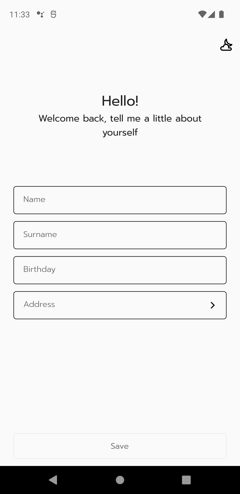  | 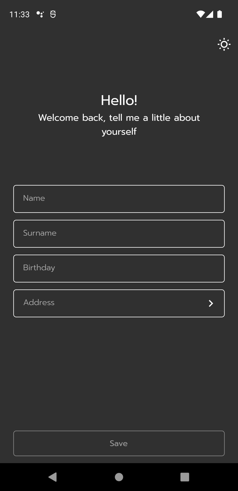  |
| 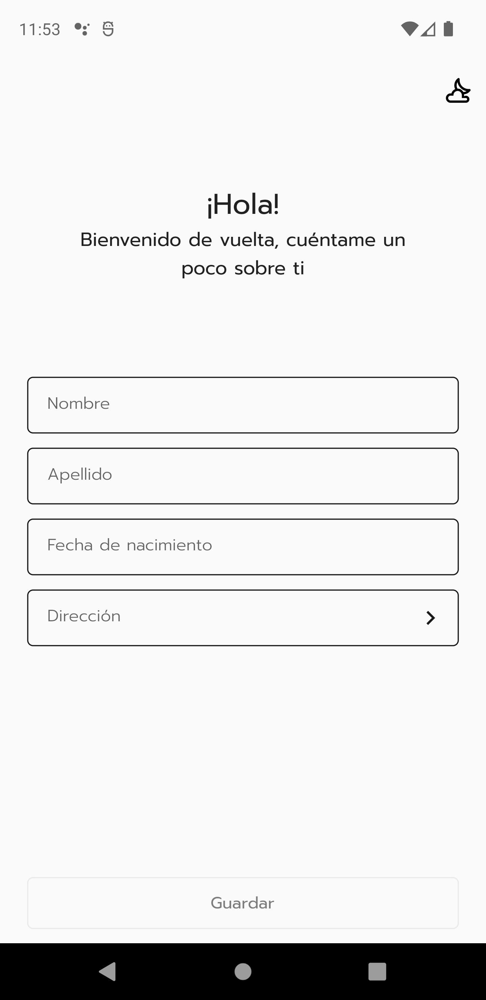  | 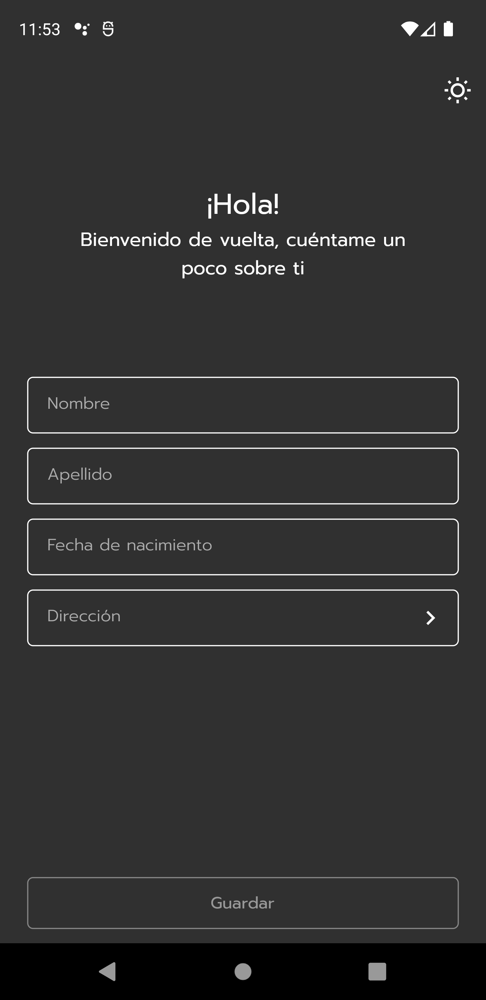  |

<details>
  <summary>📱 <b>More screenshot</b></summary>

| Light                             | Dark                              |
| --------------------------------- | --------------------------------- |
| 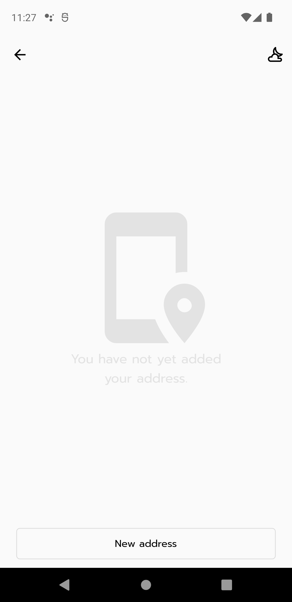  | 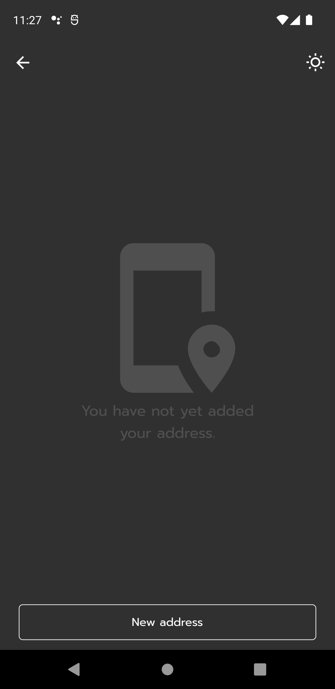  |
| 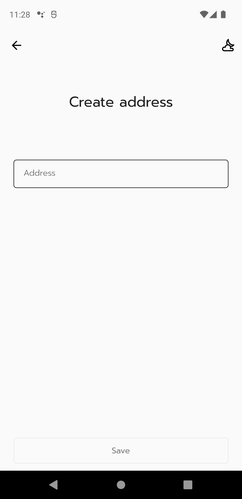  | 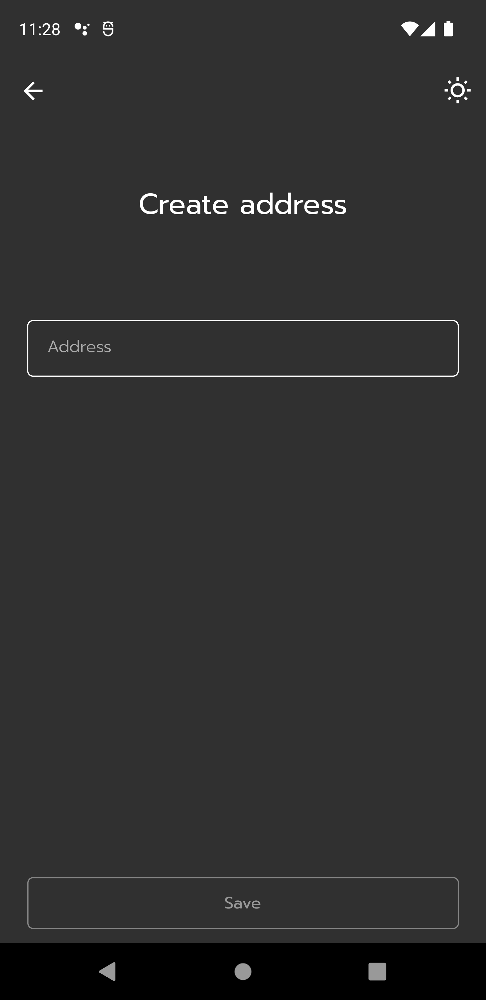  |
| 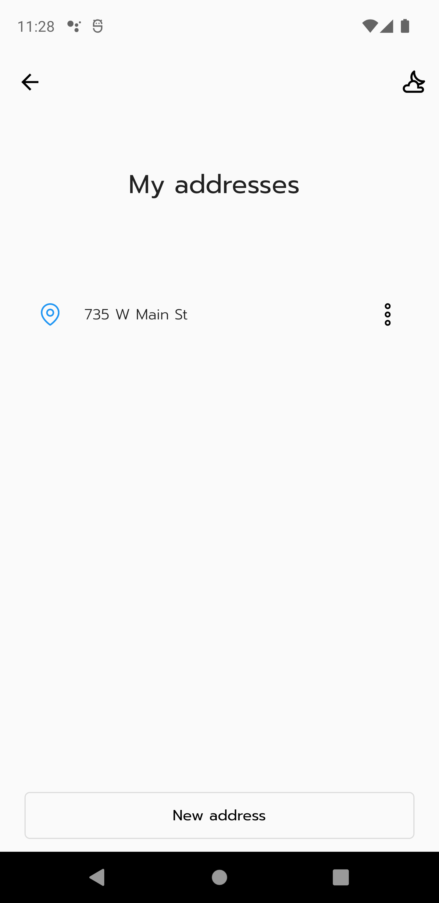  | 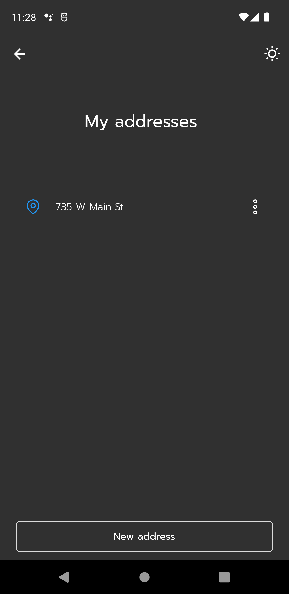  |
| 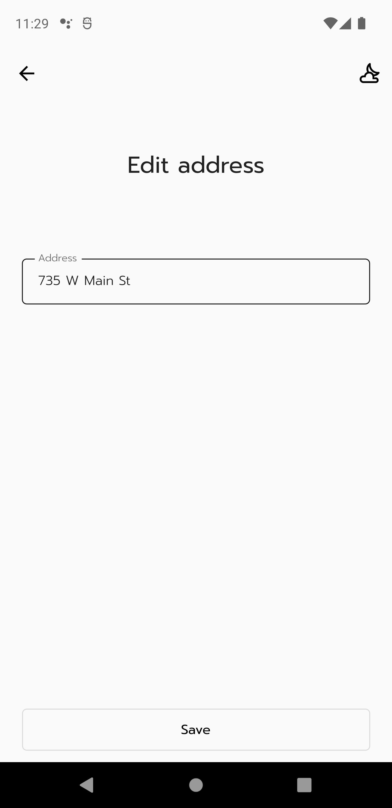  | 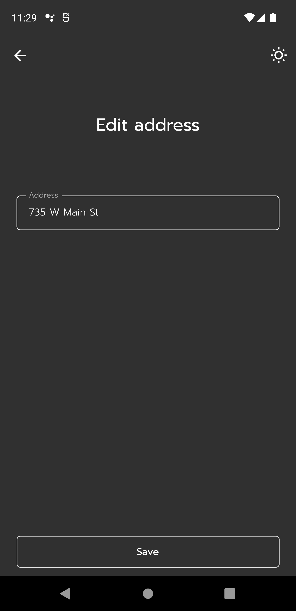  |
| 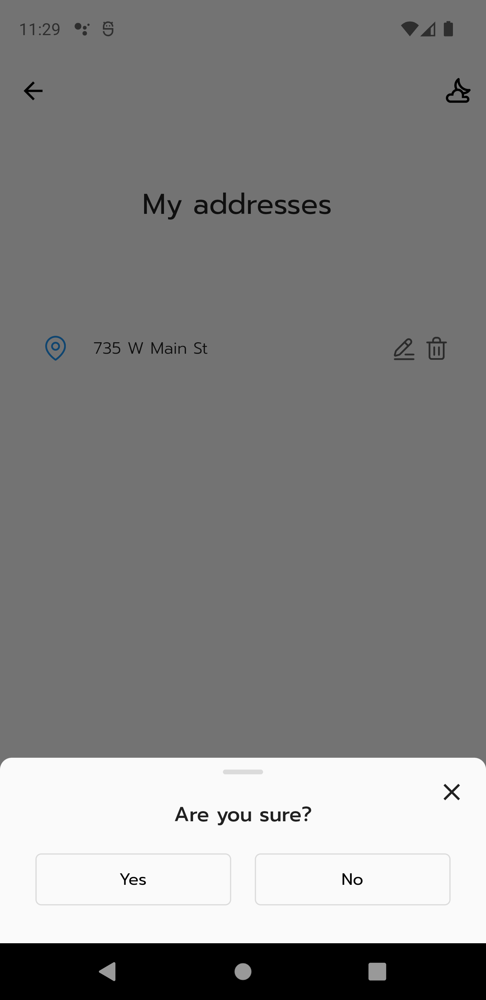  | 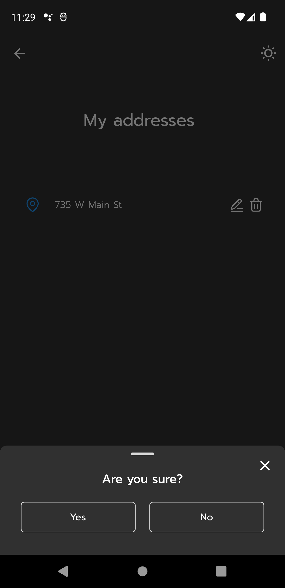  |
| 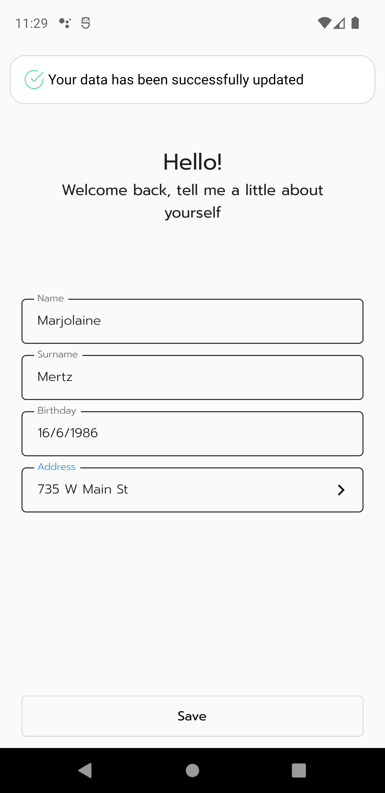  | 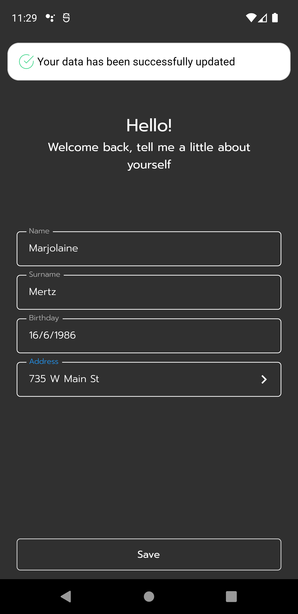  |
| 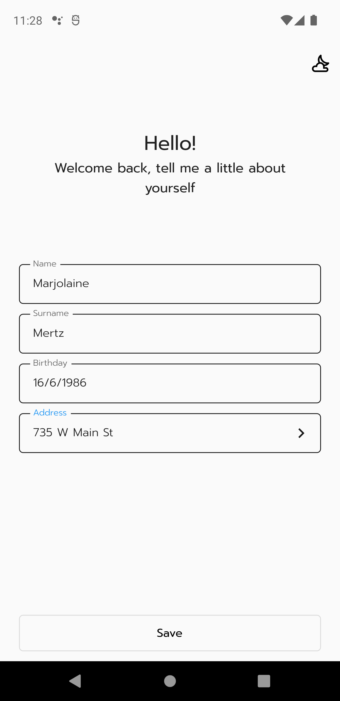  | 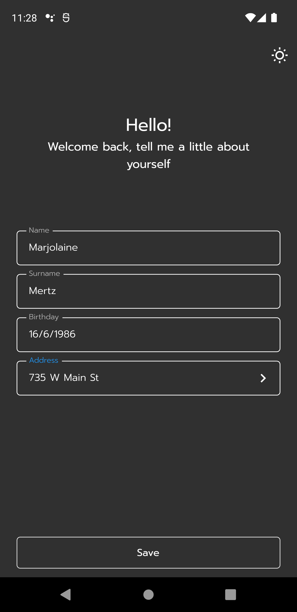  |

</details>

</br>

## 🔌 Packages

| Name                                                          | Usage                                               |
| ------------------------------------------------------------- | --------------------------------------------------- |
| [**Get It**](https://pub.dev/packages/get_it)                 | Service Locator                                     |
| [**BLoC**](https://pub.dev/packages/bloc)                     | State Management                                    |
| [**Hive**](https://pub.dev/packages/hive)                     | NoSQL database to store user data                   |
| [**SQLite**](https://pub.dev/packages/sqflite)                | SQL database to store address list                  |
| [**Google Fonts**](https://pub.dev/packages/google_fonts)     | To use fonts from fonts.google.com                  |
| [**Dartz**](https://pub.dev/packages/dartz)                   | Functional Error Handling                           |

## 🚀 Getting Started

```bash
    flutter gen-l10n
    flutter packages pub run build_runner build --delete-conflicting-outputs
    flutter run
````

## 👨‍💻 Author(s)

**Jorge A. Mogotocoro F.** 
